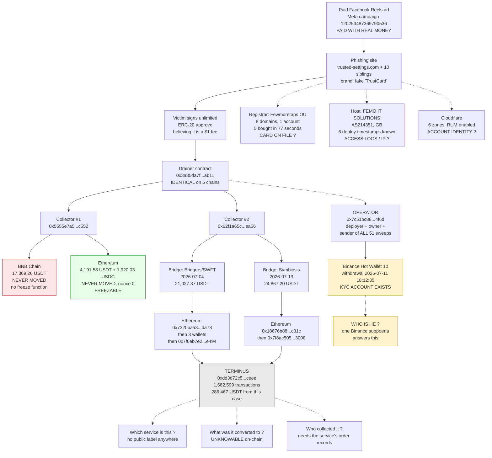
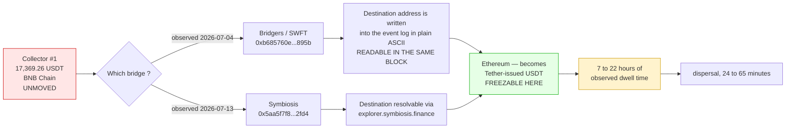

# Case map — the whole operation on one page

Last updated 2026-08-11. Every solid line is verified against public nodes or against a
written statement from the named party. Every dashed line marked **?** is unresolved and
says why.

The point of this page: show what is established, what is inferred, and exactly where the
trail stops — so that anyone picking this up knows which question is still open.

---

## 1. The whole flow



---

## 2. What is known, at a glance

| | Status |
|---|---|
| How victims are recruited | **Verified** — paid Meta ad, campaign ID recorded |
| How the theft works | **Verified** — unlimited ERC-20 approve, swept 6 seconds later |
| How many chains | **Verified** — 5, identical 9,242-byte bytecode, same `owner()` |
| How many victims | **Verified** — 61 (45 BNB Chain, 16 Ethereum) |
| Who executes the thefts | **Verified** — one address, all 51 sweeps |
| Where the money went | **Verified** to a service wallet, then **unknowable** |
| Which service that is | **Inferred only** — gas funder labelled `ChangeNOW: Deposit Funder 9` |
| What it was converted to | **Unknown, and unknowable from the blockchain** |
| Who the operator is | **Unknown** — one Binance subpoena would answer it |
| Where he is physically | **Unknown** — activity times fit no single timezone cleanly |

---

## 3. The open questions, and who can answer each

| # | Question | Only answerable by | Status |
|---|---|---|---|
| 1 | Identity of the operator | **Binance** — account behind withdrawal `0xe26636d7…` | filed with FBI, supplement 4 |
| 2 | Which service is `0xdd3d72c5…` | the service itself, or law enforcement | open |
| 3 | What the 286,467 USDT became | that service's order records | open |
| 4 | Payment card behind 8 domains | Fewmoretaps OU / Trustname | case ABS-48857 |
| 5 | Origin IP of the deployments | FEMO IT SOLUTIONS (AS214351) | reported 2026-08-10 |
| 6 | Advertiser identity | Meta Platforms | filed with FBI |
| 7 | Bridgers order `o3lkby` | SWFT Blockchain | not yet requested |
| 8 | Cloudflare account holder | Cloudflare | preservation requested |

Questions 1, 4, 5 and 6 all lead to a **real person paying with real money**. Questions 2 and
3 lead only to *where the money went*, and stop at commingled custody.

**The identity trail is stronger than the money trail.** That is the single most useful
conclusion in this document.

---

## 4. Where the trail stops, and why that is not a failure

Both laundering channels end at `0xdd3d72c53ff982ff59853da71158bf1538b3ceee` — an address with
1,662,599 transactions and 760 different tokens. That is service infrastructure holding
funds for a large number of unrelated people.

Once funds enter a pooled service wallet they are commingled. No analysis can separate one
depositor's dollars from another's — this is a property of omnibus custody, not a limitation
of tooling. Every intermediate address upstream already pools several unrelated criminal
streams.

**No allegation is made against that address or anything downstream of it.** It is named only
because it marks where on-chain attribution stops and legal process must begin.

---

## 5. The predicted path — what has not happened yet

17,369.26 USDT still sit on Collector #1 on BNB Chain, including 2,023.404141 belonging to the
author of this report. That address has made exactly **one** outgoing transaction in its
entire history.

Collector #2 already showed what happens next. It accumulated to roughly 21,000–25,000 USDT
and then emptied itself in a single bridging transaction — twice.



### Observed timings, from block timestamps

| Channel | Left BNB Chain | First onward move | Gap |
|---|---|---|---|
| Bridgers | 2026-07-04 14:17:35 | 2026-07-05 12:37:35 | **22 h 20 m** |
| Symbiosis | bridge output 2026-07-13 10:12:47 | 2026-07-13 17:28:35 | **7 h 16 m** |

In both independent observations the funds sat still for the better part of a working day
before anything happened. **The usable window is hours, not minutes.**

### Why this matters

On BNB Chain the token is Binance-Peg BSC-USD, which has no freeze function — confirmed in
writing by BNB Chain. The funds are unrecoverable *where they are*. They become recoverable
only after crossing a bridge, when they turn into Tether-issued USDT.

The route is documented in advance, and the funds have not yet travelled. That is the whole
opportunity: the destination is known before the money arrives.

---

## 6. Counter-forensics deployed against tracers

Anyone following this cluster will hit a deliberate trap. Documented in full in
[MONEY-TRAIL.md](MONEY-TRAIL.md) section 3B:

- **Counterfeit tokens named USDT.** Two contracts, `0x74a33e78…` and `0x1aa3fc6e…`, both
  return `symbol() = "USDT"`. Filtering on symbol instead of contract address mixes real and
  fake movements. This report's own first pass reported 410,000 USDT where the true figure
  was 110,000.
- **Lookalike recipients.** Decoy wallets match the real ones on both leading *and* trailing
  characters — `0xc02297fB…Db44F` (real) against `0xC0251c19…Db44F` (decoy).
- **Zero-value transfers**, which anyone can emit on Tether's contract because a
  `transferFrom` of 0 passes the allowance check trivially.

Three rules defeat all of it: filter on **contract address**, discard **zero-value**
transfers, and sanity-check every hop against the account **nonce** — an address with nonce 0
cannot have forwarded anything, however much apparent inflow an explorer shows.

---

## 7. Current balances, all chains

| Chain | Address | Holding | Freezable |
|---|---|---|---|
| BNB Chain | Collector #1 | 17,369.26 USDT | no — Binance-Peg, no freeze function |
| Ethereum | Collector #1 | 4,191.58 USDT | **yes — Tether** |
| Ethereum | Collector #1 | 1,920.03 USDC | **yes — Circle** |
| Ethereum | Collector #2 | 429.70 USDT | **yes — Tether** |
| Optimism | Collector #2 | 168.57 USDT | **yes — Tether** |
| Arbitrum | Collector #1 | 34.00 USDC | **yes — Circle** |
| Arbitrum | Collector #2 | 37.28 USDC | **yes — Circle** |
| BNB Chain | Collector #2 | 387.51 USDT | drained |

Approximately **6,781 USD is issuer-freezable today**, without waiting for any further
movement.

---

## 8. Verify any of this yourself

```bash
# same contract, five chains, same owner
for rpc in https://eth.llamarpc.com https://bsc-dataseed.binance.org \
           https://arb1.arbitrum.io/rpc https://mainnet.optimism.io https://mainnet.base.org; do
  cast call 0x3a85da7f43c7b9946a450b55019f3e05e637ab11 "owner()(address)" --rpc-url $rpc
done

# Ethereum collector: Tether balance, and a nonce of zero
cast call 0xdac17f958d2ee523a2206206994597c13d831ec7 "balanceOf(address)(uint256)" \
  0x5655e7a5197cc1a1805387bc82dfffe901dfc552 --rpc-url https://eth.llamarpc.com
cast nonce 0x5655e7a5197cc1a1805387bc82dfffe901dfc552 --rpc-url https://eth.llamarpc.com

# the Binance withdrawal that gives the operator a KYC identity
cast receipt 0xe26636d7d2d8c8f7186e89c5be5a66fdca8fd3af70f826f612f42e459267c843 \
  --rpc-url https://bsc-dataseed.binance.org
```

---

## 9. Related documents

- [MONEY-TRAIL.md](MONEY-TRAIL.md) — both laundering channels, hop by hop, with timings
- [INDICATORS.md](INDICATORS.md) — canonical indicator list for security teams
- [LIVE-INFRASTRUCTURE.md](LIVE-INFRASTRUCTURE.md) — domains, hosting, deployment timestamps
- [ALL-SWEEPS.md](ALL-SWEEPS.md) — all 51 sweep events on BNB Chain
- [CHECK-IF-AFFECTED.md](CHECK-IF-AFFECTED.md) — how to check your own wallet
